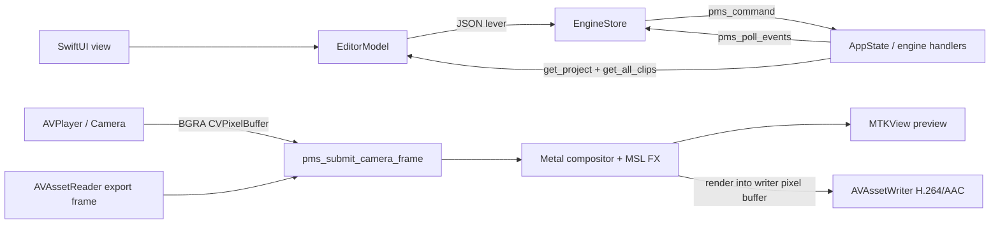

# Finish the Pop Maker Studio iOS port

> ## Status addendum — 2026-07-09 (post-cutover)
>
> Slices A and B of this document are **implemented and proven** (Linux `engine-smoke` PASS including the new handlers; simulator + unsigned device builds green against a freshly rebuilt xcframework). What changed relative to the prose below:
>
> - Engine (`pop-maker-studio` dev, uncommitted): `get_project_summary` / `list_recent_projects` / `abort_batch` handlers; verbose `clip_to_json` now emits `fx_type`, `fx_params`, `fx_chain` (with `rel_start`/`rel_end`, body sub-clip fields) and `format` in `state_to_json{,_slim}`; `set_clip_fx` reaches into `fx_chain` of MultiFX bricks and accepts `track_name`; the `pms_command` path now closes the auto-batch (undo/redo worked only over the socket before); `engine_smoke.cpp` rewritten to the §6 scenario list.
> - iOS (`pms-ios` main, uncommitted): Swift is a projection of `get_project(verbose:true)` (`EngineProjection.swift`); all mutations use the exact §4 payloads with `(track, clip)` addresses; undo/redo are the engine's; persistence is engine v64 via `save_project`/`load_project` (JSON `ProjectDoc` deleted); Home cards come from `get_project_summary` with loading/corrupt/empty states; full generated catalog (`tools/gen_effect_catalog.py` → 109 video + 5 engine-vocabulary audio FX); `ENGINE_MOCK` is a real model with indices/rejection (`MockEngine.swift`); IPC server DEBUG-gated with a request cap.
> - **Contract discoveries the prose below doesn't know:** a coupled video FX brick becomes a `multi_fx` clip snapped to the host span (never `"effect"`); BodyFX names contain spaces (`"Neon Outline"`); the engine playhead does NOT advance in `pms_tick` (desktop audio clock owns it), so on iOS the AVPlayer stays the fine clock and the engine is reconciled via `seek` at ~5 Hz + on boundaries.
> - **Slice C progress (same day):** ABI is now **2**. Mic injection is real end-to-end: `audio_capture_push` SPSC ring (131072 stereo frames, reject-newest, push-time linear resample to 44.1k) drained through `audio_capture_drain`, counters in `get_audio_perf` (`capture_injected_frames`/`capture_dropped_frames`), `pms_submit_mic_block` wired, and on iOS the camera's mic CMSampleBuffers convert via AVAudioConverter to interleaved stereo Float32. Person matte is real: `pms_submit_person_matte` → `metal_render_submit_matte` (zero-copy R8 texture, retained until command-buffer completion) → matte composite blit (person from content, background from the engine render; `fx_debug` reports `has_matte`/`matte_pso_ok`); on iOS `VisionMatte` runs a `VNSequenceRequestHandler` at ≤15 fps on its own queue, enabled when a body-FX brick exists. Coupled-brick move/trim now surfaces "decouple to edit" instead of silently reverting.
> - **Slice C/D progress (same day, second pass):**
>   - **Takes:** camera recording via an AVAssetWriter sink (h264+AAC .mov into the project's media dir, record button on the canvas); the finished take lands in the engine bin and as a clip at the playhead. The engine's loop/take event machinery (`vrecorder`) is still desktop-only — takes are plain clips on iOS for now.
>   - **Body FX:** the BodyFXInfo table is now available headless (it was stubbed to 0 under `!PMS_HAS_GL` — the iOS build had NO body FX until this fix); `list_body_fx` exposes it; the FX sheet's Body tab, inspector sliders (positional `body_fx_param_i` + `body_fx_amount`), and `set_live_fx` `body_fx` entries are wired; Metal implements matte-consuming passes for Neon Outline / Depth Blur / Glitch Body (compile-proven in the xcframework; **rendering not yet numerically verified** — the metal_render_test work was cut short, still no build target).
>   - **Models/paths:** `pms_model_status` returns a real inventory (15 model files, present/bytes) rooted at `app_models_dir()`; `pms_create` honors `asset_root` via `pms_set_asset_root` (asset_root/models first, then state_root/models; no `/proc/self/exe` on iOS).
>   - **Preview == export text:** titles are baked into the played AVComposition (same CI compositor as export); only the title being edited draws as a live overlay.
>   - **CI:** pms-ios ci.yml gained generator-syntax, catalog-freshness and C-ABI-header-diff gates (the shaders/levers + hosted-mac sim jobs already existed); pop-maker-studio gained engine.yml running the PMS_ENGINE_ONLY headless configure + engine-smoke, gated on a self-hosted Linux runner (`vars.HAS_LINUX_RUNNER`) because hosted runners lack whisper/ggml/ORT.
> - **Track layering (third pass, same day):** see `docs/TRACK_LAYERING_PLAN.md`. The Metal renderer is now the desktop scene compositor: `pms_submit_layer_frame` (ABI **3**) feeds per-(track,clip) BGRA layers; the render walks `state.tracks` bottom-to-top with eval_prop transforms/crop/flips/opacity, per-layer glass FX, per-track bus FX over the accumulated scene, and dissolve/fade-black/dip-white transitions — `set_live_fx` survives only as the no-layers fallback. Swift feeds it: primary video track via the main AVPlayer, up to 2 overlay video tracks via slaved players, text as rasters (no longer baked into the AVComposition), audio-track clips mixed as composition audio; export re-drives the same submissions per output frame (preview==export); lanes gained Move Up/Down grips over the new `move_track` lever.
> - **Still open:** device verification of the scene compositor (GPU behavior is compile-proven only), engine-side loop/take events on iOS, face beauty/warp/makeup passes, MSL ports of the hand-written desktop FX (grade/blur/vignette/… report `unknown_fx`), numeric Metal render tests, per-clip body-FX masks, model-pack download flow, on-device §6 scenarios.

**Authoritative execution handoff for agents.** Updated 2026-07-09 from the current `main` checkout of `pms-ios`, the sibling `pop-maker-studio` `dev` checkout, a successful Linux `engine-smoke`, and successful unsigned simulator/device Xcode builds on `macbookpro.local`.

This document supersedes stale status prose in `README.md`, `PLAN.md`, and `AGENT_PLAYBOOK.md`. Those documents describe the intended architecture, but several “stub” claims are now false and several “wired” claims only describe UI-local behavior. Do not infer completion from comments. Use the source and proof gates below.

## 1. Goal and non-negotiable contract

The deliverable is a touch-native iOS editor whose **project model and editing semantics are the desktop engine's**, while Apple frameworks own the platform media edges:

- C++ owns `AppState`, timeline semantics, v64 `.pms`, undo/redo, clip/FX coupling, generated effect definitions, event generation, and agent commands.
- SwiftUI owns screens and gestures.
- AVFoundation/VideoToolbox owns iOS decode, camera, and H.264/AAC encode.
- Metal owns iOS composition and generated video FX.
- Vision owns iOS person segmentation. GPL RVM must never ship in the iOS app.
- Every product edit crosses `EngineStore.command(method, params)` and `pms_command`. Local Swift state may cache/project engine state, but must not become a second incompatible editor model.
- The desktop checkout remains the source of truth for `pms_engine.h`, `.pms` serialization, handler schemas, effect registry, and authored GLSL.

A clean cutover is required. Do not keep JSON `.pms` beside v64 `.pms`, two undo stacks, two playheads, mock project cards in production, or aliases for wrong command payloads.

## 2. Repositories, branches, and verified baseline

| Repository | Branch | Purpose |
|---|---|---|
| `~/dev/pms-ios` | `main` | Swift app, bundled MSL, iOS build configuration |
| `~/dev/pop-maker-studio` | `dev` | C++ engine, desktop reference, generators |

Verified on 2026-07-09:

```text
Linux:  cmake --build ~/dev/pop-maker-studio/build --target engine-smoke -j2
Linux:  ~/dev/pop-maker-studio/build/engine-smoke
Result: engine smoke: PASS (ABI 1, .pms v64)

Mac: xcodebuild ... -destination 'generic/platform=iOS Simulator' ... build
Result: BUILD SUCCEEDED

Mac: xcodebuild ... -sdk iphoneos26.2 CODE_SIGNING_ALLOWED=NO build
Result: BUILD SUCCEEDED
```

The Mac has Xcode 26.3, iOS 26.2 SDK, XcodeGen 2.45.4, a connected iPhone, and both frameworks under `pms-ios/Engine/build/`.

Current code that is real:

- `pms_engine` core and command dispatcher.
- Apple Metal background/content compositor.
- Zero-copy BGRA `CVPixelBuffer` submission.
- Runtime loading and execution of the generated MSL video-effect registry.
- Swift AVPlayer/AVComposition multi-clip decode and preview.
- Swift AVAssetReader/AVAssetWriter export with H.264 video and AAC audio.
- Swift AVFoundation camera preview.
- Linux engine ABI smoke.

Current code that is not complete:

- Swift timeline/project state is not hydrated from, or consistently mutated through, `AppState`.
- Existing FX command payloads are wrong for the real handlers.
- `ProjectStore` writes incompatible JSON while desktop writes binary v64.
- Camera audio, loop takes, person matte submission, face-filter Metal passes, and model-pack status are absent.
- Python MCP-only actions are exposed as if they were native commands.
- Only a curated effect subset is represented in Swift.
- Engine Apple media handlers remain headless stubs; the current app works around them directly in Swift.

## 3. Current runtime and the intended final flow



The final architecture may keep Apple decode/export in Swift. That is not a violation: those are platform backends, not editor semantics. The violation today is that Swift independently owns tracks, project serialization, undo, effect placement, and transport state without reconciliation to the engine.

## 4. Required source edits — complete file map

### `pms-ios/App/Sources/EngineBridge.swift`

Make the bridge safe, observable, and authoritative.

1. Replace `try!` JSON construction with a typed error path.
2. Normalize command replies so callers receive `result`, not an envelope they repeatedly reinterpret.
3. Treat a top-level `error` as a failed mutation. Do not leave an optimistic UI mutation in place.
4. Add lifecycle validation after `pms_create`:
   - `pms_abi_version() == PMS_ENGINE_ABI`
   - log/report `pms_project_version()`
   - run `get_project` once and reject an unusable engine.
5. Add `stop()`/`deinit` that invalidates `CADisplayLink` and calls `pms_destroy`.
6. Publish all event state the current engine emits: playhead, pipeline, loudness, face track, and takes. Do not invent snapshot/search/audio events until the engine emits them.
7. Add matte and mic ABI wrappers when their C functions land.
8. Keep all C ABI calls serialized. `pms_command` is main-thread; export may use a dedicated engine executor only while ticks and preview are paused.

Target Swift shape:

```swift
@MainActor
final class EngineStore: ObservableObject {
    struct PipelineState: Equatable {
        var stage = "idle"
        var progress = 0.0
        var message = ""
    }

    enum EngineError: LocalizedError {
        case notStarted
        case encode(String)
        case nullReply
        case rejected(String)
        case malformedReply
        var errorDescription: String? { /* exhaustive switch */ }
    }

    @Published private(set) var playhead = 0.0
    @Published private(set) var playing = false
    @Published private(set) var pipeline = PipelineState()
    @Published private(set) var takeCount = 0
    @Published var lastError: String?

    func result(_ method: String, _ params: [String: Any] = [:]) throws -> Any {
        guard engine != nil else { throw EngineError.notStarted }
        // serialize; invoke pms_command; decode object
        // if envelope["error"] exists: publish + throw
        // otherwise return envelope["result"] ?? [:]
    }
}
```

Do not make `ENGINE_MOCK` acknowledge every unknown command. The mock must model rejection, track/clip indices, and project queries or UI bugs remain hidden until device builds.

### `pms-ios/App/Sources/EngineProjection.swift` (new)

Add one decoder/projection file instead of scattering untyped `[String: Any]` parsing across views.

Required types:

```swift
struct EngineProjectSnapshot {
    var duration: Double
    var fps: Double
    var bpm: Double
    var playhead: Double
    var projectPath: String
    var tracks: [EngineTrackSnapshot]
    var markers: [EngineMarkerSnapshot]
    var bin: [String]
}

struct EngineTrackSnapshot: Identifiable {
    let id: Int                 // engine track index
    var name: String
    var muted: Bool
    var locked: Bool
    var clips: [EngineClipSnapshot]
}

struct EngineClipAddress: Hashable {
    let track: Int
    let clip: Int
}

struct EngineClipSnapshot: Identifiable {
    let address: EngineClipAddress
    var id: EngineClipAddress { address }
    var type: String
    var start: Double
    var end: Double
    var inPoint: Double
    var text: String
    var source: String?
    var coupled: Bool
}
```

Decode from:

- `get_project(verbose: true)` for full project/clip properties.
- `get_all_clips` for a cheap address refresh after mutations.

The engine currently has no stable clip UUID. Swift IDs must therefore be `EngineClipAddress`, refreshed after every insertion/deletion/split. Never persist a generated Swift clip ID as if the engine knows it.

### `pms-ios/App/Sources/Models.swift`

Delete the incompatible assumptions:

- `Clip.id: String` as an engine identity.
- hard-coded `Sample.projects` as the production home model.
- hard-coded `Effects.video/body/audio` as the effect source of truth.
- MCP-only actions represented as direct engine lever names.

Preserve only UI-friendly wrappers that have an explicit engine address.

Generate effect definitions from `pop-maker-studio/effects/mcp_manifest.json`. Add `tools/gen_effect_catalog.py`, producing `App/Sources/GeneratedEffectCatalog.swift` with all manifest entries:

```swift
struct EffectDef: Identifiable, Hashable {
    let id: String
    let name: String
    let category: String
    let description: String
    let params: [Param]
    struct Param: Hashable {
        let key: String
        let label: String
        let min: Double
        let max: Double
        let def: Double
        let format: String
    }
}
```

Audio effect IDs must use engine vocabulary (`audio_reverb`, `audio_delay`, `audio_autotune`, `audio_pitch`, `audio_formant`), not `aud_*` aliases. Body FX are not generated video shaders; represent them with the engine `BodyFXInfo` names (`NeonOutline`, `DepthBlur`, etc.) only after adding an engine query/manifest for them.

### `pms-ios/App/Sources/EditorModel.swift`

This is the largest Swift cutover.

#### Initialization

1. New project: send `new_project(force: true)`, `set_format`, then create only required tracks via `add_track`.
2. Existing project: send `load_project(path: ProjectStore.docURL(id).path)`.
3. Hydrate from `get_project(verbose: true)`.
4. Build `VideoPlayback.Segment` values from engine video clip snapshots. Swift AVFoundation is a decoder/backend, not the owner of clip timing.

#### Mutations

Every operation must:

1. resolve `EngineClipAddress` from the current projection;
2. call the exact engine handler;
3. on success refresh the projection;
4. on failure leave/revert UI state and surface `EngineStore.lastError`.

Exact payload contracts:

```swift
// Move
try engine.result("move_clip", [
    "track": address.track, "clip": address.clip, "start": newStart
])

// Trim (engine adjusts in_point when start changes)
try engine.result("trim_clip", [
    "track": address.track, "clip": address.clip,
    "start": newStart, "end": newEnd
])

// Split
try engine.result("split_clip", [
    "track": address.track, "clip": address.clip, "time": playhead
])

// Delete
try engine.result("delete_clip", [
    "track": address.track, "clip": address.clip
])

// Fade/property
try engine.result("set_clip_prop", [
    "track": address.track, "clip": address.clip,
    "prop": "fade_in", "value": fadeIn
])

// Add ordinary video FX brick
let result = try engine.result("add_effect_brick", [
    "track": host.track,
    "fx_type": effect.id,
    "start": start, "end": end,
    "params": params
])

// Add global FX on the GFX rail
let result = try engine.result("add_effect_brick", [
    "track_name": "GFX",
    "fx_type": effect.id,
    "start": start, "end": end,
    "params": params
])

// Add video Multi-FX brick (delete/recreate to change a chain)
try engine.result("add_multifx_brick", [
    "track": host.track, "start": start, "end": end,
    "effects": chain.map { ["fx_type": $0.id, "params": $0.params] }
])

// Add audio Multi-FX brick
try engine.result("add_audio_multifx_brick", [
    "track": host.track, "start": start, "end": end,
    "effects": chain.map { ["fx_type": $0.id, "params": $0.params] }
])

// Set one FX parameter
try engine.result("set_clip_fx", [
    "track": brick.track, "clip": brick.clip,
    "fx_id": effectID, "params": [key: value]
])

// Decouple
try engine.result("decouple_fx_brick", [
    "track": brick.track, "clip": brick.clip
])

// Body FX: one body_fx clip + props
let created = try engine.result("add_clip", [
    "track": host.track, "type": "body_fx", "start": start, "end": end
])
let ci = extractInt(created, key: "clip")
try engine.result("set_clip_props", ["ops": [
    ["track": host.track, "clip": ci, "prop": "body_fx_type", "value": bodyType],
    ["track": host.track, "clip": ci, "prop": "body_fx_amount", "value": amount]
]])
```

Do not call nonexistent handlers `add_body_fx_brick` or `remove_background`. On iOS, person segmentation must use the Vision matte ABI described below, while the body clip selects the Metal body pass.

#### Undo/redo

Delete the local `[Track]` snapshot stacks. Engine handlers already auto-batch individual mutations. For compound actions:

```swift
try engine.result("begin_batch", ["label": "Add body effect"])
do {
    // compound commands
    try engine.result("end_batch")
} catch {
    // add a C++ abort_batch handler before relying on compound failure recovery
    throw error
}
```

Use `undo`/`redo`, then refresh the projection. Until `abort_batch` exists, validate the entire compound edit before `begin_batch` so a mid-batch failure cannot strand global batch state.

#### Transport

There must be one public playhead and playing state. The engine owns transport semantics. AVPlayer follows it:

- UI sends `play`, `pause`, and `seek` to engine.
- engine playhead events update `EngineStore`.
- `VideoPlayback` seeks/plays/pauses as a follower.
- prevent feedback loops when AVPlayer reports periodic time.

#### Local Metal FX stack

`set_live_fx` is an Apple render adapter, not a desktop agent tool. Keep it temporarily so the current MSL renderer can display engine-projected FX bricks, but build its stack **from the engine projection**, not a separate Swift brick array. Remove it when `pms_render` can derive the same stack directly from `AppState`.

### `pms-ios/App/Sources/ProjectStore.swift`

Delete `ProjectDoc` JSON serialization. A `.pms` file means the engine's binary v64 format.

Keep only sandbox paths, media copying, poster generation, and metadata sidecars that are explicitly not `.pms`:

```swift
enum ProjectStore {
    static func docURL(_ id: String) -> URL { dir(id).appendingPathComponent("project.pms") }

    static func save(engine: EngineStore, id: String) throws {
        _ = try engine.result("save_project", ["path": docURL(id).path])
    }

    static func load(engine: EngineStore, id: String) throws {
        _ = try engine.result("load_project", ["path": docURL(id).path])
    }
}
```

Because home cards need metadata without loading each full project into the singleton engine, add a C++ read-only project-summary API instead of decoding v64 in Swift.

### `pop-maker-studio/src/ipc_server.cpp`: add `get_project_summary` and `list_recent_projects`

The engine already owns `recent_projects_list()` and the serializer. Expose both as read-only handlers.

Required response:

```json
{
  "path": "/.../project.pms",
  "name": "project",
  "duration": 18.0,
  "fps": 30.0,
  "format": "vertical",
  "clip_count": 7,
  "fx_count": 4,
  "modified_unix": 1783612345
}
```

Implementation requirements:

- `get_project_summary(path)` loads into a temporary `AppState`; it must not tear down the open project, audio, or render state.
- `list_recent_projects` maps `recent_projects_list()` through the same summary helper.
- Add both schemas to the generated agent tool manifest only if agents need them. The Home screen can call unlisted handlers through `pms_command`, but listing is preferred for one public contract.
- Add them to `engine-smoke` with a saved fixture.

### `pms-ios/App/Sources/HomeView.swift`

Replace synthetic project cards and Picsum URLs. Home cards come from the project directory plus engine summaries. Keep rename/delete and poster sidecars. Required states:

- empty library;
- corrupt/unreadable project with a visible error, not silent omission;
- loading summaries;
- new project;
- rename/delete.

New project identity must use a full UUID, never a six-character prefix.

### `pms-ios/App/Sources/VideoPlayback.swift`

Keep this as the AVFoundation media backend, but make it consume engine projection.

Required corrections:

- `buildComposition` must accept all engine video/audio clips, not only one Swift video track.
- Apply `speed` by scaling inserted time ranges.
- Use engine `in_point`, fade, opacity, transforms, and z-order.
- Do not ignore `insertTimeRange` failures with `try?`; propagate an import/playback error.
- Add cancellation for rebuild tasks so rapid edits do not install stale compositions.
- Cache filmstrips under the project cache, not unbounded random temp files.
- Make text cache keys include all style fields, not only ID/label/size.
- On export failure, include AVAssetReader/Writer error descriptions.

The current export loop is a valid Apple backend. Keep it until `trigger_export` has an Apple implementation; do not route iOS to the desktop ffmpeg/GL export handler.

### `pms-ios/App/Sources/MetalPreview.swift`

- Check and surface `pms_render` return codes.
- Use an explicit drawable size matching the selected format and device scale.
- Remove Swift `LyricOverlay` once text is rendered into the same Metal/CI frame used by export; preview-only overlays violate preview==export.
- Continue pausing the preview while export has exclusive render access.

### `pms-ios/App/Sources/CameraCapture.swift`

Fix capture lifecycle and wire audio/matte:

- Request camera/mic authorization and report denial.
- Never use `try? c.start`; expose failure in the UI.
- Keep references to video/audio outputs; do not recreate duplicate outputs on repeated starts.
- Call `beginConfiguration`/`commitConfiguration` with failure-safe cleanup.
- Remove `UIDevice.current.orientation` double-rotation. Frames are already rotated to portrait via `videoRotationAngle`; submit rotation `0` unless the connection could not rotate.
- Route audio CMSampleBuffers through an `AVAudioConverter` to interleaved stereo Float32 and call `pms_submit_mic_block`.
- Run Vision segmentation at a bounded cadence (for example 15 fps preview), not synchronously on the video delegate.
- Add an AVAssetWriter take sink for camera recording. The engine retains loop/take state, but iOS owns muxing.

### `pms-ios/App/Sources/VisionMatte.swift`

`VisionMatte` exists but has no caller. Keep Vision work off the main/video delivery queue. Reuse one `VNSequenceRequestHandler` for temporal stability. Return a retained OneComponent8 `CVPixelBuffer` to the ABI.

### `pop-maker-studio/src/pms_engine.h` and `pms-ios/Engine/include/pms_engine.h`

Bump the ABI after adding these calls, then copy the desktop header to iOS during the xcframework build:

```c
void pms_submit_person_matte(pms_engine*, void* cv_pixel_buffer_r8,
                             double host_time_seconds);

// Accepts interleaved stereo Float32. The engine copies before returning.
void pms_submit_mic_block(pms_engine*, const float* interleaved_lr,
                          size_t frames, double sample_rate);

#define PMS_ENGINE_ABI 2
```

Do not add raw Objective-C types to the public header.

### `pop-maker-studio/src/pms_engine.cpp`

- Store `asset_root` in a new centralized path override.
- Make `pms_model_status` return real JSON.
- Implement `pms_submit_mic_block` by copying/resampling into an engine-owned capture injection ring.
- Route `pms_submit_person_matte` to Metal.
- Stop using process-global Metal state for multiple engines; move the Metal backend into `pms_engine` ownership before supporting more than one instance/test host.

### `pop-maker-studio/src/paths.h` and `paths.cpp`

Add:

```cpp
void pms_set_asset_root(std::string root);
std::string app_asset_root();
std::string app_models_dir();
```

On iOS, `app_models_dir()` must resolve bundled models under `asset_root` first, then downloaded packs under `state_root/models`. Current `readlink("/proc/self/exe")` logic cannot be the iOS path strategy.

### `pop-maker-studio/src/audio.h` and `audio.cpp`

Add an external-capture injection API rather than reaching into recorder globals:

```cpp
void audio_capture_push(const float* interleaved_lr,
                        size_t frames,
                        double sample_rate);
```

Requirements:

- copy before returning;
- fixed-capacity SPSC ring, no allocation in the hot path;
- resample to the engine's 44.1 kHz stereo format outside the callback if input differs;
- `audio_capture_drain` drains both native-device capture and injected capture through one contract;
- define overflow behavior and expose dropped-frame count in `get_audio_perf`.

### `pop-maker-studio/src/metal_render.h` and `metal_render.mm`

Current Metal supports background, content blit, and generated video FX. Add:

```cpp
void metal_render_submit_matte(void* cv_pixel_buffer_r8, double t);
```

Then implement passes in this order:

1. person matte composite/background replacement;
2. body outline/depth/glitch passes consuming the matte;
3. face beauty/warp/makeup passes consuming face observations;
4. text layers in the same render path as export;
5. multi-layer compositor for engine track z-order.

The matte is not one of `Shaders/msl/*.metal`; those files are generated ordinary full-frame effects. Body and face passes are hand-written engine passes with explicit vertex/uniform ABI.

Correctness requirements:

- no `CVMetalTextureCacheFlush` per frame unless profiling proves it necessary;
- retain each `CVMetalTextureRef` until every referencing command buffer completes;
- never mutate shared ping-pong textures from preview and export concurrently;
- return a nonzero error when shader compilation or render encoding fails instead of silently skipping every requested effect;
- expose detailed renderer diagnostics through `fx_debug`.

### `pop-maker-studio/src/metal_render_test.mm`

Turn the existing image writer into assertions. Add deterministic cases:

- aurora only;
- portrait aspect-fit;
- one generated FX;
- two-FX order;
- effect outside its time window;
- matte composite;
- malformed/missing shader returns an error.

The test must check pixels/numeric error, not only write a PNG.

### `pms-ios/App/Sources/FXSheet.swift` and `InspectorView.swift`

- Render the generated full catalog.
- Disable effect placement if there is no valid host/address; never fall back to fake IDs `c1`/`a1`.
- Await real engine success before dismissing the sheet.
- Show handler error text.
- When welding a chain, delete/recreate the engine brick because `add_multifx_brick` creates a brick; it does not mutate one by a string ID.
- Inspector parameter controls bind to the engine projection and use the correct `fx_id`.

### `pms-ios/App/Sources/Sheets.swift`

#### Media

Replace hard-coded cards with engine project-bin paths. Use `add_to_bin`, `remove_from_bin`, and native file/photo pickers. Tapping a bin item creates a real engine clip.

#### Lyrics

Make the sheet reachable. Separate “Add text” from “Typography”. Animation chips call `set_clip_prop(clip_style)`. Presets call `set_typography_preset` only for engine-generated lyric clips.

#### Agent

Do not expose host-Python tools as native methods. Native direct actions may call:

- `describe_video(path)` only when the model is available;
- `analyze_audio(path)` only when the Apple backend exists;
- `trigger_pipeline` only when required packs exist.

Implement composite actions in Swift only from working primitives, or hide them with a concrete unavailable reason. Never show a fake successful transcript.

#### Export

Keep `VideoExporter` as the iOS backend. Add cancel, actionable failures, storage checks, and a share-only path when Photos permission is denied. Do not call the desktop `trigger_export` until its Apple backend exists.

### `pms-ios/App/Sources/EditorView.swift`

- Surface camera start/authorization errors.
- Split the current Text button into add-text and style actions; `LyricsSheet` is currently unreachable.
- Show `EngineStore.lastError` with a dismissible alert/banner.
- Disable actions while projection refresh or export owns the engine.
- Ensure all timeline tracks are vertically scrollable.
- Save through binary engine persistence on background/disappear.

### `pms-ios/App/Sources/IPCServer.swift`

Keep this development-only. Gate startup behind `#if DEBUG` and a user setting. Do not expose port 8765 in production. Add maximum request size and reject connections that exceed it. Never `DispatchQueue.main.sync` from main; assert the receive callback is off-main or use `Task { @MainActor ... }`.

### `pms-ios/project.yml`

- Add any new Swift generated files automatically through `App/Sources`.
- Copy the current engine header from the built xcframework, never a stale manual copy.
- Bundle face assets/model manifests under `EngineAssets` once licensed assets exist.
- Keep simulator mock only until an x86_64 simulator engine slice exists. Do not pretend simulator proves real engine integration.
- Add a real device build CI job once secrets/signing are available; unsigned device link remains the baseline gate.

### `.github/workflows/ci.yml`

Add gates:

1. Python syntax for generators.
2. generated effect catalog freshness.
3. C ABI header diff.
4. desktop engine `check_engine_deps` + `engine-smoke` in the engine repository workflow, or a sibling checkout build here.
5. simulator Swift build.
6. unsigned device link against the xcframework.
7. macOS Metal renderer numeric tests.

Do not use a mocked simulator build as proof that real engine calls work.

## 5. Apple media/backend boundary decisions

### Keep in Swift/Apple frameworks now

- AVAsset probe/decode and filmstrips.
- AVComposition assembly.
- AVAssetReader/Writer export.
- AVCaptureSession.
- Vision person segmentation.
- Photos and share sheets.

### Keep in C++ engine

- project/timeline structure and addresses;
- binary v64 persistence;
- undo/redo and mutation validation;
- FX definitions/coupling/timing;
- generated MSL effect selection and params;
- renderer output;
- loop/take state and events;
- model-pack inventory.

This division gets a working App Store path without forcing Objective-C++ AVFoundation backends through every desktop subsystem. It still preserves the engine as editor source of truth.

## 6. Required tests and proof scenarios

### Linux gates

```bash
cd ~/dev/pop-maker-studio
cmake --build build --target check_engine_deps engine-smoke -j2
./build/engine-smoke

cd ~/dev/pms-ios
python3 -m py_compile tools/gen_levers.py tools/transpile_shaders.py tools/gen_effect_catalog.py
PMS_DESKTOP=../pop-maker-studio python3 tools/gen_levers.py
PMS_DESKTOP=../pop-maker-studio python3 tools/gen_effect_catalog.py
# generated files must be unchanged after regeneration
```

Extend `engine-smoke` to exercise:

1. new project;
2. add video/text tracks and clips;
3. move, trim, split;
4. add/set/decouple/delete FX;
5. undo/redo;
6. save v64;
7. load v64 in a second engine;
8. assert equivalent `get_project(verbose:true)`;
9. summary/list query;
10. event drain.

### Mac gates

```bash
ssh macbookpro.local xcodebuild \
  -project /Users/alexis/dev/pms-ios/PopMakerStudio.xcodeproj \
  -scheme PopMakerStudio \
  -destination 'generic/platform=iOS Simulator' \
  -configuration Debug \
  -derivedDataPath /Users/alexis/dev/pms-ios/build/dd-sim \
  CODE_SIGNING_ALLOWED=NO build

ssh macbookpro.local xcodebuild \
  -project /Users/alexis/dev/pms-ios/PopMakerStudio.xcodeproj \
  -scheme PopMakerStudio \
  -sdk iphoneos26.2 \
  -configuration Debug \
  -derivedDataPath /Users/alexis/dev/pms-ios/build/dd-device \
  CODE_SIGNING_ALLOWED=NO build
```

Also run the numeric Metal tests on macOS. A PNG existing is not a pass.

### Device scenarios

1. Create a 9:16 project; import two phone videos; quit/relaunch; both return with exact timing.
2. Drag, trim, split, undo, redo; compare engine `get_project(verbose:true)` to the UI after each step.
3. Add two generated FX, adjust parameters, preview, export; compare representative frames within tolerance.
4. Add title text/style/animation; confirm it appears identically in preview and export.
5. Camera preview for five minutes at target frame rate without growth/leak.
6. Person matte/background replacement on front and rear cameras.
7. Record a loop take with mic; receive a takes event; replay with synchronized audio.
8. Save on iPhone, copy `.pms` plus collected media to desktop, load successfully; perform the reverse direction.
9. Deny Camera, Mic, Photos, and Local Network permissions one at a time; app remains usable and explains the unavailable action.
10. Put device in background during import/export/record; operation either resumes safely or cancels with a concrete state.

## 7. Parallel agent ownership

Agents may work concurrently only across these ownership boundaries:

| Lane | Files |
|---|---|
| Engine state/persistence | `ipc_server.cpp`, `project*.cpp`, `engine-smoke.cpp` |
| Swift projection/editor | `EngineProjection.swift`, `EditorModel.swift`, `Models.swift` |
| Apple playback/export | `VideoPlayback.swift`, export section of `Sheets.swift` |
| Capture/matte/audio | `CameraCapture.swift`, `VisionMatte.swift`, C ABI/audio injection |
| Metal hand passes | `metal_render.*`, `metal_render_test.mm` |
| Catalog/codegen | `gen_effect_catalog.py`, generated Swift, CI |
| Product UI | Home/Editor/Timeline/FX/Inspector/Sheets after projection API is agreed |

Before editing a shared file, agents must coordinate. Every lane returns exact changed files and the focused proof it ran. One integration owner runs the final builds and device scenarios.

## 8. Ordered delivery slices

### Slice A — source-of-truth cutover

- typed command errors;
- engine projection decoder;
- correct mutation payloads;
- engine undo/redo;
- binary v64 save/load;
- real project home summaries;
- full generated effect catalog.

Exit: create/import/edit/save/relaunch works; engine and UI snapshots agree; `.pms` loads on desktop.

### Slice B — current Apple editor made reliable

- AVPlayer follows engine transport;
- all current video/text/FX editing flows use engine state;
- preview/export share content, titles, generated FX;
- actionable error/cancel paths;
- simulator and unsigned device builds green.

Exit: two-clip edit with text and generated FX exports correctly on device.

### Slice C — capture parity

- camera permissions/lifecycle;
- mic injection;
- Vision matte ABI;
- matte/body Metal passes;
- AVAssetWriter take sink and engine take events.

Exit: live person effect and an audio/video loop take work on device.

### Slice D — advanced desktop features

- face beauty/warp/makeup Metal passes;
- downloaded model packs and CoreML/ORT validation;
- native transcript/beat workflows;
- keyframes, loop region, markers, richer transforms;
- native compositions for MCP-only actions.

Exit: each exposed feature has an on-device proof. Unimplemented features remain hidden, not fake.

## 9. Known traps

- The engine's mutation API uses integer track/clip indices. Indices change after delete/split/insert. Refresh immediately.
- `add_multifx_brick` creates a brick. It does not mutate a Swift string brick ID.
- `set_clip_fx` requires `fx_id` and integer address.
- `remove_background` and `add_body_fx_brick` are not C++ handlers.
- `trigger_export` is dead under `PMS_HEADLESS`; current Swift export is the working iOS backend.
- `ProjectStore` JSON is not desktop `.pms` despite its extension.
- `pms_create(asset_root)` currently ignores `asset_root`.
- iOS `app_models_dir()` cannot rely on `/proc/self/exe`.
- Swift comments claiming pixels or parity are not proof.
- Simulator is `ENGINE_MOCK` on this Intel Mac. Real engine testing is device/macOS-host only.
- Do not ship the debug TCP IPC listener enabled.

## 10. Definition of done

The port is complete only when:

- the engine is the sole project/timeline/undo source of truth;
- iOS and desktop roundtrip the same v64 `.pms` project with collected media;
- all visible controls either work through valid handlers/backends or are absent with a concrete unavailable state;
- generated effect metadata contains every desktop registry effect;
- preview/export match for the supported generated and hand-written passes;
- camera, mic, person matte, and takes work on a physical device;
- model-dependent features report pack state and do not silently no-op;
- Linux engine smoke, macOS Metal tests, simulator compile, unsigned device link, and focused device scenarios pass.
